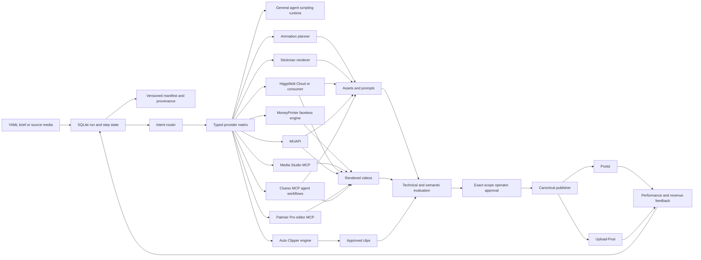

# Architecture

## One control plane, three engines

SQLite in `data/content-studio.sqlite3` is authoritative for run, step, event, retry, cancellation, and budget state. The versioned `data/runs/<run-id>/manifest.json` is authoritative for the creative brief, selected providers, artifacts, immutable hashes, dependency provenance, semantic evidence, approval, publish drafts, and receipts. Engines may have internal compatibility state, but final artifacts must be recorded before downstream consumption.

## Durable state machine

Each lane expands to typed steps such as `script`, `keyframes`, `motion`, `voice`, `assembly`, `evaluation`, `approval`, `publish`, and `metrics`. Safe deterministic steps advance automatically. External work blocks with machine-readable `next_actions`; resume and retry continue from persisted state. Retry counts and idempotency keys live with each step, while paid spend is updated under an immediate SQLite transaction.

Manifest schema v2 assigns every artifact a stable id, SHA-256, byte size, MIME type, creation time, provider, dependencies, and optional scene/model/job/source evidence. Schema-v1 runs migrate in memory without dropping artifacts.

## Boundaries

| Module | Owns | Does not own |
|---|---|---|
| `hivemind_content_studio` | durable runs, manifests, intents, providers, planning, MCP adapters, approvals, evaluation, experiments, publishing | donor rendering internals |
| `app` | faceless scripts, LocalTTS adapter, stock retrieval, subtitles, MoviePy/FFmpeg rendering | publishing or global provider selection |
| `auto_clipper` | long-form ingestion, clipping, clip-specific rights data, monetization matches | global publisher implementation |
| `skills/shared` | Shared Brain agent playbooks and provider operating knowledge | executable business logic |
| `skills/vendor/clueso-ai` | pinned upstream Clueso workflows, audit provenance, and namespaced policy adapters | provider selection, approvals, credentials, or publishing authority |
| `packages/media-gateway` | local media gateway, ComfyUI proxy, model manager, Media Studio MCP, native-sidecar routing | canonical content runs, approvals, publishing, or metrics |
| `packages/open-generative-ai` | embedded Explore UI, model catalog, local inference, desktop IPC bridge | canonical run state, approvals, or publishing |
| `packages/comfyui-mobile` | embedded Canvas workflow editor, queue, output browser, and model manager | canonical run state or direct publishing |
| `engines/flux-2-swift-mlx` and `engines/z-image-swift` | native Apple Silicon generation engines | browser shell, orchestration, approval, or distribution |
| `packages/unified-studio-launcher` | portable service manifest, workflow installers, tests, and launcher patterns | a second production dashboard or runtime state machine |

## Unified all-in-one Studio

The browser exposes one shell with Create, Edit, Animate, Workflow, Explore,
Canvas, Models, Runs, History, Telemetry, and Providers. Creation modes share
the composer, model router, reference-image intake, durable run, artifact
library, prompt history, approval gates, and telemetry. Explore and Canvas are
full-height embedded package surfaces; they do not own a second canonical run
store. The desktop shell forwards only the allowlisted OpenGen local-inference
IPC methods to the Explore frame. Browser mode reaches the same local engine
through the loopback OpenGen bridge without exposing the gateway token.

`GET /api/runtime` remains a bounded operator diagnostic. It reports the one
native surface, internal engines/gateways, and Liam-fork/upstream provenance.
HTTP probes run concurrently with short timeouts and return generic status
only. Package source provenance is recorded in `components.json`. Results that
enter a durable production are recorded in the versioned manifest before
downstream use.

## Provider routing

`PROVIDER_MATRIX` in `src/hivemind_content_studio/providers.py` is the only provider capability registry. Each row declares roles, local/cloud mode, requirement by key/service name, costs, side effects, and fallback. CLI, MCP, and doctor output derive from it.

`CapabilityRouter` maps provider-neutral intents to those roles and rejects candidates that violate readiness, privacy, allowlist, or remaining-budget policy. The decision includes selected implementation, fallbacks, and rejection evidence. `ContentIntentService` dispatches only registered executors; provider discovery never authorizes arbitrary code or an unbounded API request. The intent service and the deterministic stickman/static orchestrator wrapper share one generation-attempt recorder that writes `generation.started`, `generation.completed`, and `generation.failed` events for run-associated image, video, voice, and music work. The events contain bounded operational metadata only. Aggregate telemetry is available through the local API, CLI, MCP tool/resource, and browser Telemetry view; successful timing samples are also mirrored best-effort into HivemindOS's cross-app generation metrics.

Local-first defaults are:

- script: any HivemindOS or CLI agent through the general agent-runtime contract
- image: ComfyUI
- motion/image-to-video: HivemindOS Media Studio MCP
- timeline editing/export: Palmier Pro MCP when installed
- voice: Universal TTS
- music: ACE-Step
- assembly: MoneyPrinterTurbo
- clipping: Auto Clipper
- publishing: Postiz

Cloud providers remain optional alternatives for capacity, model quality, or unavailable local services.

`openai-gpt-image` uses the official Image API and `OPENAI_API_KEY`. `openai-gpt-image-oauth` is a separate beta provider that asks the HivemindOS OpenAI OAuth broker to call the ChatGPT/Codex Responses backend with a required `image_generation` tool. The OAuth token is never treated as public Image API authority and never reaches the studio or browser. `xai-imagine-api` uses `XAI_API_KEY`, while `xai-imagine-oauth` delegates token storage, refresh locking, login, and media bearer access to the authenticated local HivemindOS broker. The API-key and OAuth modes remain distinct provider rows so readiness and provenance name the real credential surface.

Clueso is modeled as an agent-scoped manual provider because its authenticated
MCP tools live in the active agent runtime, not inside the studio process. Its
90 workflows are stored once as pinned upstream reference material and exposed
through small namespaced adapters. Those adapters first apply a central policy;
they cannot override provider routing, privacy, cost, rights, or publishing
gates. Readiness stays false until the acting agent verifies its own MCP tool
inventory, so the matrix never claims that an OAuth session exists by inference.

Higgsfield is intentionally split into `higgsfield-cloud` and `higgsfield-consumer`; an API-key-backed server job and a logged-in consumer CLI session are different auth surfaces. MUAPI schemas are endpoint-specific, so a run must carry an explicit discovered endpoint and payload template. Direct paid executors run only after an exact provider/intent/amount/target receipt has been approved and consumed; the internal `PAID_GENERATE` constant is not an agent authority.

`hivemindos-hosted-media` is a delegated commercial rail, not a BYOK provider. The studio sends the explicit model payload, agent identity, idempotency key, and approved maximum to the authenticated local HivemindOS route. The private gateway owns provider credentials, the exact provider quote, 25% markup, credit reservation, refund/reconciliation, job ownership, and receipt. HivemindOS company governance is the single approval authority for this rail, so an autonomous company can spend inside policy without a duplicate studio approval while freezes, budgets, approval thresholds, and the hosted credit balance fail closed.

The first-frame animation, stickman performance, and static text lanes share evaluation, approval, publishing, and metrics contracts. First-frame uses generated keyframes plus image-to-video; stickman uses deterministic black-line frames with optional generated cut-ins; static text uses deterministic plain-background creative for low-cost test variants.

## Side-effect gates

1. Planning creates a run directory and durable local state only.
2. Agent scripts execute only through operator-registered runtime ids; agents cannot submit argv over MCP.
3. Remote assets and provider downloads are bounded, public-HTTPS validated, and provenance recorded.
4. Direct paid generation requires a cost estimate inside the remaining budget and a signed, exact-scope, one-time operator receipt. HivemindOS-hosted generation instead requires a live quote and maximum debit, then delegates authorization to HivemindOS company governance.
5. Technical QA and structured semantic evaluation are separate; failed scenes carry regeneration instructions.
6. Rights/claims run approval also consumes a one-time operator receipt. Agents may request it but cannot decide it over MCP.
7. A publish draft requires a real asset; dry-run is side-effect free.
8. Live publishing additionally requires approved state, `CONTENT_STUDIO_ENABLE_LIVE_PUBLISH=true`, and `LIVE_PUBLISH`.

## Agent and human surfaces

MCP is primary. It exposes durable lifecycle, intent, safe asset-ingestion, evaluation, experiment, and metric tools plus URI resources for capabilities, providers, run state, artifacts, and next actions. Operator approval decisions are intentionally absent.

The same FastAPI service hosts a dependency-free browser studio and its same-origin API. A typed lane matrix drives both browser choices and backend validation. Browser drafts are validated and converted to canonical briefs before the existing orchestrator executes them; the UI never owns a second state machine or durable browser storage. Create is brief-first, while production, provider, voice, distribution, and operator configuration use progressive disclosure. Runs expose next actions, workflow steps, and manifest-approved artifact links. Protected resume, retry, cancellation, and approval mutations still require the control bearer token.
