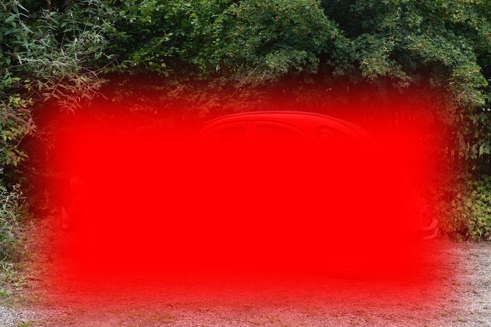
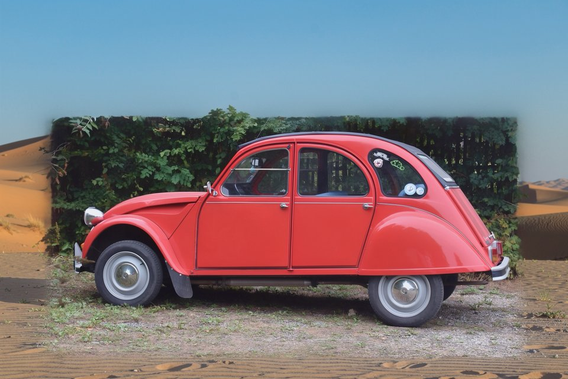
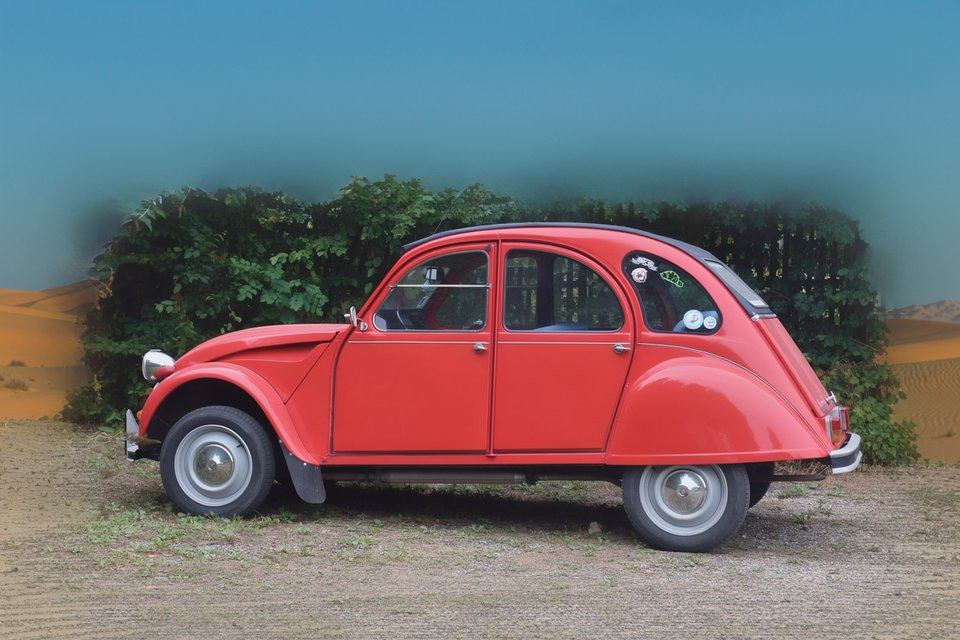

# Masked inpainting — `Flux2MaskedInpaintingChain`

RePaint-style per-step latent blending: at every denoising step the region
outside the user mask is forced back to the original image latent (re-noised
to the next sigma). Only the inside-mask region accumulates new content.

No special Fill checkpoint is required — this works on every FLUX.2 base/
distilled checkpoint.

## API

```swift
import Flux2Core
import Flux2Chains

let pipeline = Flux2Pipeline(
    model: .klein9B,                   // distilled is fine, 4 steps
    quantization: .memoryEfficient
)
try await pipeline.loadModels()

let chain = Flux2MaskedInpaintingChain(
    pipeline: pipeline,
    prompt: "a vintage red Citroën 2CV in a sandy desert at golden hour",
    image: inputCGImage,
    mask: maskCGImage,                 // white = inpaint, black = keep
    steps: 4,
    guidance: 1.0,
    seed: 42
)
let result = try await chain.run()     // result.image: CGImage
```

## Inputs

| Reference photo | Soft mask (preview) |
|:-:|:-:|
|  |  |

The mask is a grayscale `CGImage` with the same dimensions as `image`. White
pixels mark the region the model is allowed to paint. Black pixels are kept
pixel-perfect by RePaint at every step (including the last one, where
`sigmaNext == 0` restores the clean original latent).

The mask is a separate single-channel PNG:


## Hard mask vs soft mask

Using a hard rectangle mask creates a visible rectangular seam around the
kept region. **Apply a Gaussian blur on the mask** (radius ≈ image_width /
30) so the transition fades naturally.

| Hard mask | Soft mask (radius 80 px on 1920 wide image) |
|:-:|:-:|
|  |  |

The chain accepts soft masks unchanged — `packMaskForLatentBlending` keeps
soft values in `[0, 1]`. The denoising blend then mixes the painted region
with the kept region in proportion to the gradient.

## Notes

- Mask convention is **white = inpaint, black = keep**, matching SD-style
  conventions. Soft values are honoured.
- The chain runs on the standard `generateWithResult` path under the hood,
  so progress callbacks, profiling, memory caps, and scheduler overrides
  all behave like a regular text-to-image run.
- On a 1024² image, klein-9B distilled at 4 steps takes ≈ 1 min on M2 Ultra
  96 GB with the `.memoryEfficient` preset.

## See also

- `Flux2OutpaintingChain` — same primitive plus canvas extension and I2I
  conditioning, for outpainting (`../outpainting/`).
- Source: `Sources/Flux2Chains/Flux2MaskedInpaintingChain.swift`.
- CLI: `sharp-cli inpaint` (in the sibling repo `rephoto-swift-coreml`).
