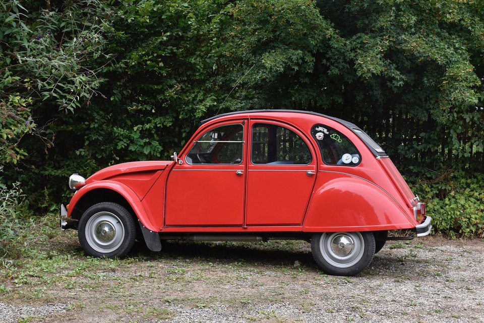
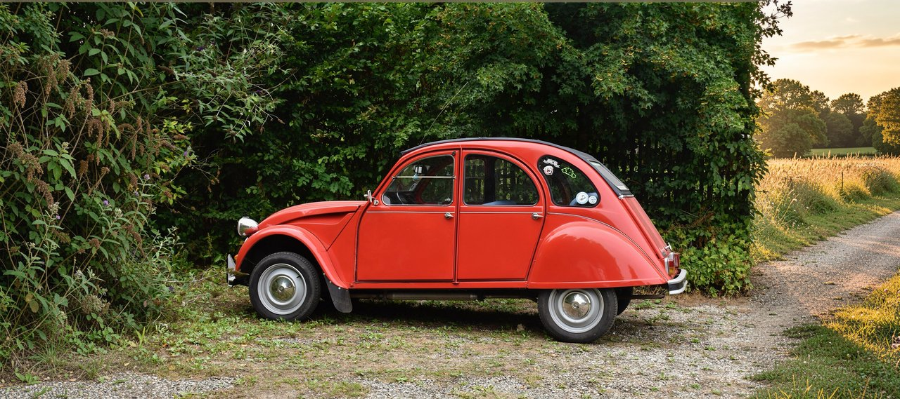
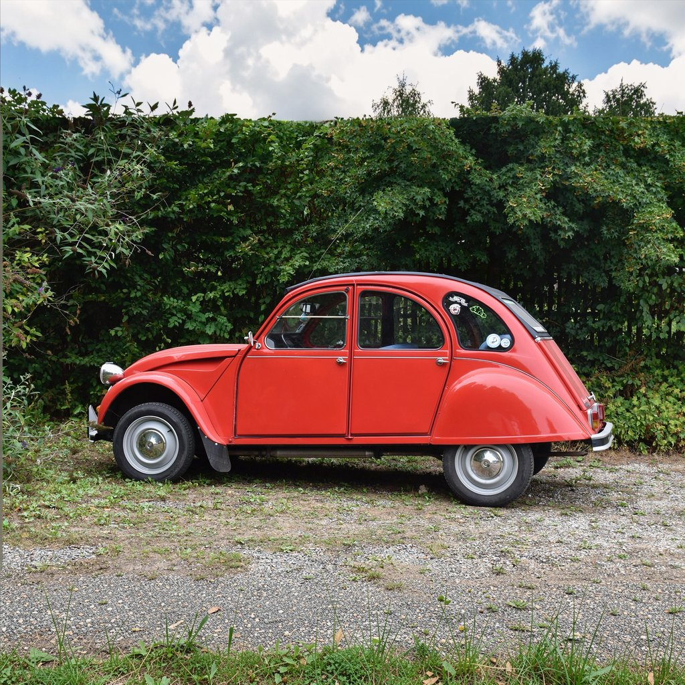
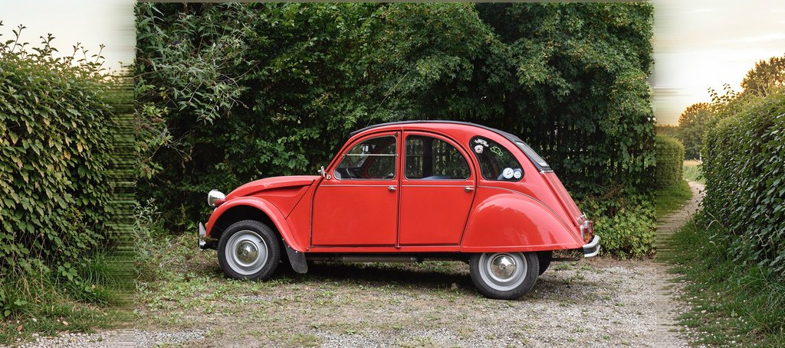
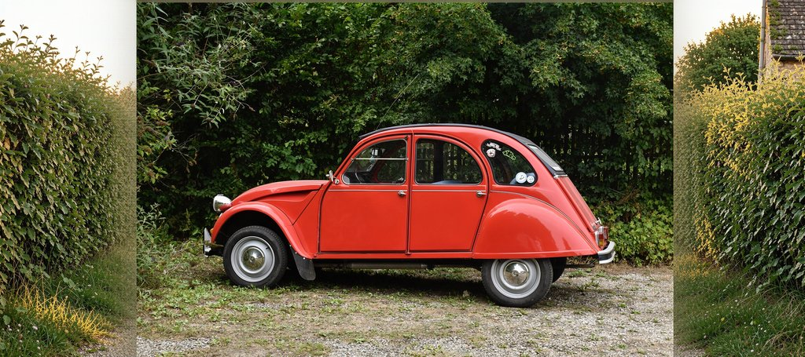
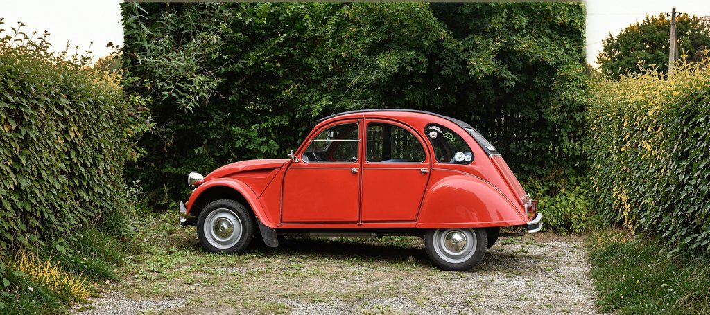
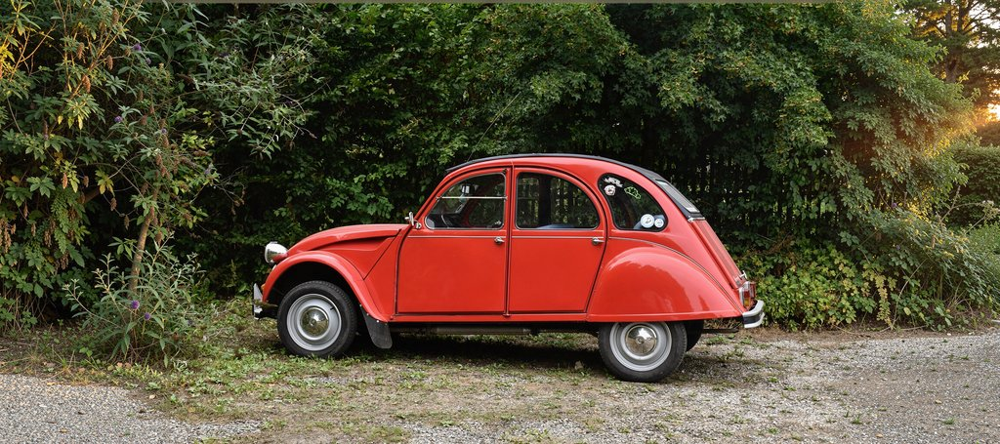

# Outpainting — `Flux2OutpaintingChain`

One-liner outpainting matching Black Forest Labs' Flux outpainting service
surface: caller passes per-side padding in pixels + a prompt, the chain
handles canvas extension, mask construction, noise seeding, and I2I+RePaint
inference internally.

## API

```swift
import Flux2Core
import Flux2Chains

let pipeline = Flux2Pipeline(
    model: .klein9B,
    quantization: .memoryEfficient
)
try await pipeline.loadModels()

let chain = Flux2OutpaintingChain(
    pipeline: pipeline,
    image: inputCGImage,
    top: 0, bottom: 0,
    left: 480, right: 480,             // pixels to add per side
    prompt: "panoramic countryside, golden hour, lush hedge, gravel path",
    seed: 42
)
let result = try await chain.run()     // result.image: CGImage
```

Paddings are silently rounded up to multiples of 32 (FLUX.2 requirement).
A 1920×1280 input with `left: 480, right: 480` becomes a 2880×1280 canvas.

## Horizontal extension (panoramic)

`left: 480, right: 480` on a 1920×1280 photo → 2880×1280 panoramic canvas:



→



The hedge continues at the same density on both sides, the gravel path
extends to a golden-hour cornfield horizon, the lighting matches. No
visible seam.

## Vertical extension (square 1:1)

`top: 320, bottom: 320` on the same 1920×1280 photo → 1920×1920 canvas:



The hedge grows tall toward a partly cloudy sky in the new top band; grass
and pebbles fill the new bottom band. Centre untouched.

## What the chain does internally

1. **Round paddings up** to multiples of 32 and build the extended canvas.
2. **Paste the original** at offset `(left, top)`.
3. **Seed the new strips** with neutral mid-grey Gaussian noise (Box-Muller,
   seeded from the chain's seed). Crucially, **never** with stretched
   edge-replicate strips — that signal leaks through the mask gradient and
   produces visible vertical bands.
4. **Build a smart mask** in one pass:
   - White (1.0) on every strip outside the keep region.
   - Black (0.0) deep in the keep region.
   - Narrow ramp (default 32 px) on a band **inside** the keep region,
     adjacent to each side that actually has a strip.
5. **Invoke `Flux2MaskedInpaintingChain`** with `referenceImages: [original]`
   so the transformer's attention sees the keep region and continues style/
   colours/perspective into the strips.

## Why the ramp is inside the keep

If the ramp covers the strip side of the boundary, the seed (whatever it
is — edge-replicate, red, noise) blends with the model's fresh paint in
proportion to the mask value, producing a visible vertical band. By moving
the ramp inside the keep:

- In the strips, `mask = 1.0` strictly → `(1-mask) * seed = 0` → only fresh
  paint survives.
- The transition happens on already-modifiable territory (the model is
  allowed to slightly retouch the inner edge of the kept region) so there
  is no abrupt seam either.

This is the most important detail of the recipe — see the diagnostics below.

## Smart mask (visualization)

The mask used for the panoramic example, downsized for display:


White strips on the sides, narrow gradient ramps near the centre, black
center.

## Diagnostics — the road to the recipe

We tried four seed/mask combinations before landing on the working one.
All four use the same prompt, same model (klein-9B distilled), same seed
and step count; only the canvas/mask construction differs.

### v1 — edge-replicate seed + soft Gaussian mask

Filling the new strips with stretched columns from the source seemed
"plausible" but the seed signal leaks through the wide Gaussian transition
as visible striped bands:



### v3 — Gaussian-noise seed + soft Gaussian mask

Switching the seed to neutral grey noise removes the striping, but the
right side now hallucinates incoherent content (the right hedge merges
with what looks like a different scene) because the model has no visual
attention on the kept centre:



### v4 — Gaussian-noise seed + **smart mask**

Smart mask (white strips + 32 px inner ramp + black keep) eliminates the
seam, but the right side still drifts toward a different scene (a white
wall behind the hedge appears) because, again, no I2I attention:



### v5 — same as v4 + I2I reference

Adding the original image as an I2I reference is the final piece. The
transformer now attends to the kept content and continues it. **Clean**:



`Flux2OutpaintingChain` packages this exact recipe behind a single
function call.

## See also

- `Flux2MaskedInpaintingChain` — the underlying primitive used by this
  chain (`../inpainting/`).
- Source: `Sources/Flux2Chains/Flux2OutpaintingChain.swift`.
- CLI: `sharp-cli outpaint` (in the sibling repo `rephoto-swift-coreml`).
